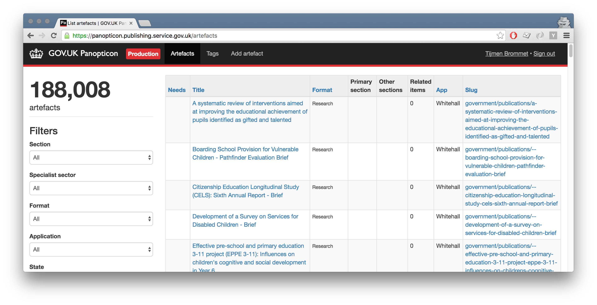

# Panopticon

Panopticon is an application originally built to act as a central repository for content on GOV.UK. It is being deprecated.



## Live examples

- [panopticon.publishing.service.gov.uk](https://panopticon.publishing.service.gov.uk)

## Features & deprecation

This application is slowly being dismantled in favour of the new GOV.UK publishing
platform ([publishing-api](https://github.com/alphagov/publishing-api) and
[content-store](https://github.com/alphagov/content-store)).

You can find [the status of the deprecation on the GOV.UK Wiki](https://gov-uk.atlassian.net/wiki/x/FYCoBQ).

## Nomenclature

- **Artefact**: a document on GOV.UK.

## Technical documentation

Panopticon provides three interfaces:

- An admin UI where items can be created and their metadata edited
- A writeable API where applications can register the content they provide
- A read API for retrieving metadata about a given item

Panopticon shares a database with [Mainstream Publisher](https://github.com/alphagov/publisher), [Content API](https://github.com/alphagov/govuk_content_api) and [Travel Advice Publisher](https://github.com/alphagov/travel-advice-publisher). They share application code via the [govuk_content_models](https://github.com/alphagov/govuk_content_models) gem.

### Dependencies

- [publishing-api](https://github.com/alphagov/publishing-api) for registering URLs.
- [router-api](https://github.com/alphagov/router-api) also for registering URLs.

### Running the application

In the development VM:

```
cd /var/govuk/development && bowl panopticon
```

The app with appear at http://panopticon.dev.gov.uk/.

### Running the message queue

Frontend apps rely on the tagging data in  [content_api](https://github.com/alphagov/govuk_content_api) to show breadcrumbs. Panopticon listens to any changes in publishing-api via the message queue and saves this data.

To run the message queue:

```
govuk_setenv panopticon bundle exec rake message_queue:consumer
```

### Running the test suite

`bundle exec rake`

## Licence

[MIT License](LICENCE)
